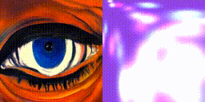
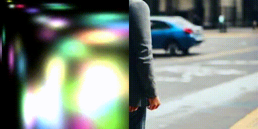

# Experiments with 2D gaussians

## Set up

```bash
git clone https://github.com/belkakari/DrawingWithGaussians.git
cd DrawingWithGaussians
pip install poetry
poetry install
```

For CUDA machine I suggest using the docker image provided or install jax with CUDA support following their official [installation guide](https://jax.readthedocs.io/en/latest/installation.html)

## Overview
This is not a "production-ready project" by any means but rather my attempts at a low-level tweaking of different image representations based on gaussians and how to control them. I might move to 3D at some point but for now it's more about 2D and adapting some methods I like to 2D setup.

## Fit 2D gaussians to an image

```bash
python fit_2d.py --config-name fit_to_image.yaml
```



Here I initialize 50 gaussians and split them every epoch based on the gradient values. After each epoch I multiply all of the gaussians colors by `cfg.gaussians.color_demp_coeff` which is 0.1 here

## Fit 2D gaussians with a diffusion prior

```bash
python fit_2d.py --config-name diffusion_guidance.yaml
```

Prompts is `A man standing on the street`, it nicely detereorates in an abstract image probably due to the low number of gaussians (50->88->159->256->378), annealing is on, img2img every 50 steps


Another example without annealing but with img2img every 250 steps



This is not SDS but rather something similar to [StableDreamer](https://arxiv.org/abs/2312.02189), meaning that I just use img2img mode of SD as a ground truth. No gradients are being passed through the sampling process
There is a lot to be optimized in terms of the sampling itself (e.g. different checkpoint, different scheduler)

A bit about the config:
- `img2img_freq` sets up how often to run img2img, 1 means every step, >1 means that gaussians are being optimised for a diffusion image for a img2img_freq steps
- `height`/`width` sets up the dimensions in which SD is being inferred since SD1.4 (I know, I'll pick a fancier one later) is quite sensitive to resolution. It is downsampled to `image.height`/`image.width` after inference for gaussians optimization
- `strength_annealing` toggles diffusion strength scaling so that in the beggining it's set to `strength`, but at `num_epochs * num_steps` it becomes zero (the idea is that with more optimization steps one does not need to diffuse that much)

## ToDO
- [x] Move boilerplate to separate functions
- [x] Add SSIM
- [ ] Ability to copy optimizer state from before the pruning (copy for the splitted gaussians)
- [ ] Test "deferred rendering" like in [SpacetimeGaussians](https://oppo-us-research.github.io/SpacetimeGaussians-website/)
- [x] Add SDS with SD
- [x] Add basic 3D version
- [ ] Add proper camera sampling (e.g. take from [vispy](https://vispy.org/api/vispy.scene.cameras.arcball.html))
- [ ] Add alternative alpha-composing with occlusions (prune gaussians based on opacity, currently prunning based on color norm, probably won't do this untill I'll decide to move to 3D)

## References
Based on [3DGS](https://repo-sam.inria.fr/fungraph/3d-gaussian-splatting/), [fmb-plus](https://leonidk.com/fmb-plus/), [GaussianImage](https://arxiv.org/abs/2403.08551), works ok on macbook m1 up to ~300 gaussians
Fast 3dgs borrowed from [jaxsplat](https://github.com/yklcs/jaxsplat)
