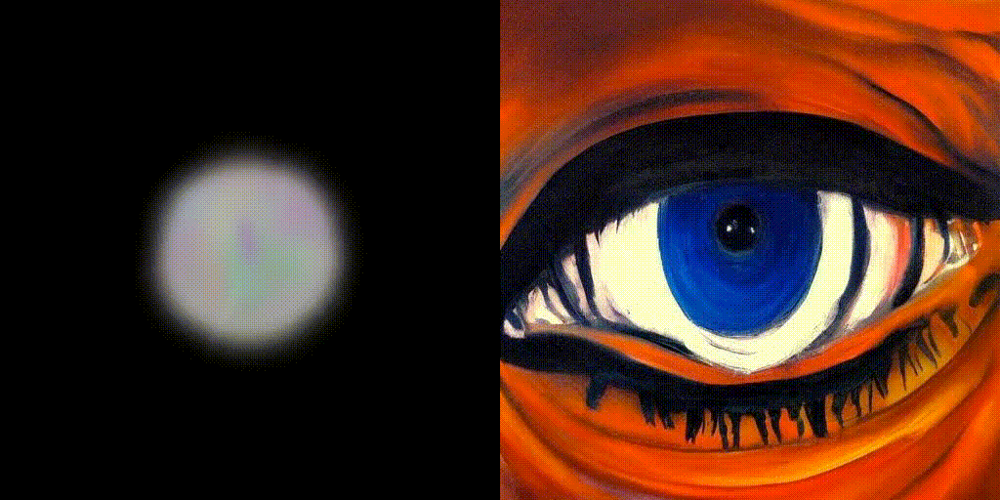

# Drawing with Gaussians

Experimental MLX-only Gaussian fitting on Apple Silicon (Metal GPU). The repo fits 2D Gaussians to an image and also includes a fixed-camera 3D Gaussian-splatting image fitter that can export SuperSplat-compatible PLY files. Not production code — expect research-project rough edges.

## Set up

The project uses [`uv`](https://docs.astral.sh/uv/) and is pinned to Python 3.11.

```bash
git clone https://github.com/belkakari/DrawingWithGaussians.git
cd DrawingWithGaussians
curl -LsSf https://astral.sh/uv/install.sh | sh
uv sync
```

Run the default 2D fit:

```bash
uv run python fit.py --config-name fit_to_image.yaml
```

Run the default 3D fit:

```bash
uv run python fit3d.py --config-name fit_to_image_3d.yaml
```

## Overview

This is a low-level playground for optimizing image representations made from Gaussians. The original codebase was JAX/Flax; the current implementation is MLX-only and uses fused Metal rasterization kernels for the hot paths.

Supported paths:

- **2D fitting** (`fit.py`): anisotropic 2D Gaussians alpha-composited over a trainable background.
- **3D fitting** (`fit3d.py`): 3D Gaussian splatting with a fixed pinhole camera, gsplat-style projection/rasterization, and SuperSplat-compatible `final.ply` export.
- **Pixel loss only**: `(1 - w) * L1 + w * (1 - SSIM)`, with `ssim_weight: 0.2` by default.

The old diffusion-guidance / Stable Diffusion path was not ported to MLX and intentionally raises `NotImplementedError` if selected.

## Fit 2D Gaussians to an image

```bash
uv run python fit.py --config-name fit_to_image.yaml
```



The default 2D config starts from 10 Gaussians and refines at epoch boundaries. High-gradient Gaussians are duplicated or split, collapsed/low-signal Gaussians are pruned, split children start with damped colors, and the background is damped after refine to force a global re-fit. The means LR uses cosine warm restarts so newborn Gaussians get a high learning rate each epoch.

## Fit 3D Gaussians and export to SuperSplat

```bash
uv run python fit3d.py --config-name fit_to_image_3d.yaml
```

The default 3D config starts from 500 Gaussians at 512×512 and refines between epochs. Densification uses gsplat-style **absgrad** by default: the fused backward kernel accumulates per-pixel absolute screen-space means-gradient contributions, which avoids cancellation and works better at higher resolutions than the old net-gradient signal.

After training, `fit3d.py` writes:

```text
outputs/<date>/<time>/final.ply
```

The PLY uses the standard uncompressed 3DGS field layout (`x y z`, `f_dc_*`, `opacity`, `scale_*`, `rot_*`) and can be opened in [SuperSplat](https://github.com/playcanvas/supersplat).

## MLX-specific notes

- 2D Gaussian covariance uses a lower-triangular `L`; its diagonal is parameterized in log-space (`log_diag`) so scales stay positive without an upper clamp.
- 3D Gaussian scales are also log-parameterized and exported as 3DGS log scales.
- Rasterization hot paths are fused Metal kernels (`rendering2d_fused.py`, `rendering3d_fused.py`) with custom VJPs. Dense renderers remain as reference implementations for validation.
- Training steps are compiled with `mx.compile`; the step is rebuilt at epoch boundaries because densification changes the number of Gaussians.
- Per-epoch split/prune is implemented eagerly with NumPy because MLX still lacks the dynamic indexing primitives needed for this path. It runs only once per epoch, so the overhead is negligible.
- Densification currently uses fresh optimizer state after each refine by default; carrying Adam moments is available as a config knob but performed worse in experiments.

## Validation and experiments

Kernel/reference checks:

```bash
uv run python tests/test_kernels.py
```

See [`EXPERIMENTS.md`](./EXPERIMENTS.md) for performance notes, densification A/Bs, SSIM results, and implementation trade-offs.

## TODO / ideas

- [x] Move boilerplate to separate functions.
- [x] Add SSIM loss.
- [x] Add fused 2D rasterization and compiled training.
- [x] Add fixed-camera 3D Gaussian splatting.
- [x] Add SuperSplat-compatible PLY export.
- [x] Add gsplat-style 3D absgrad densification.
- [ ] Explore larger-scale tiled/intersection data structures for very high Gaussian counts.
- [ ] Investigate SPZ export.
- [ ] Test deferred rendering ideas like [SpacetimeGaussians](https://oppo-us-research.github.io/SpacetimeGaussians-website/).

## References

Based on ideas from [3D Gaussian Splatting](https://repo-sam.inria.fr/fungraph/3d-gaussian-splatting/), [fmb-plus](https://leonidk.com/fmb-plus/), [GaussianImage](https://arxiv.org/abs/2403.08551), [gsplat](https://github.com/nerfstudio-project/gsplat), and related MLX/Metal splatting projects.
