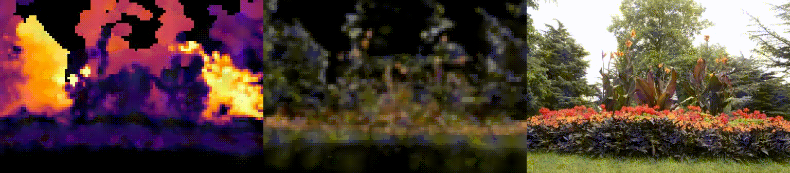
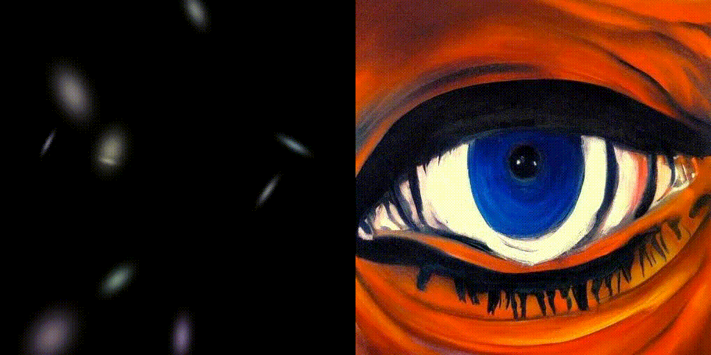

# Drawing with Gaussians

Experimental MLX-only Gaussian fitting on Apple Silicon. MLX schedules the
fused rasterization and optimizer kernels on Metal streams over unified memory.
The repo includes image fitting plus COLMAP-scene 2DGS/3DGS training and standard
degree-3 SH PLY export. Not production code — expect research-project rough edges.

## Set up

The project uses [`uv`](https://docs.astral.sh/uv/) and is pinned to Python 3.11.

```bash
git clone https://github.com/belkakari/DrawingWithGaussians.git
cd DrawingWithGaussians
curl -LsSf https://astral.sh/uv/install.sh | sh
uv sync
```

Run the default 2D fit:

```bash
uv run python fit.py --config-name fit_to_image.yaml
```

Run the default 3D fit:

```bash
uv run python fit3d.py --config-name fit_to_image_3d.yaml
```

## Overview

This is a low-level playground for optimizing image representations made from Gaussians. The implementation is MLX-only and uses fused Metal rasterization kernels for the hot paths.

Supported paths:

- **2D fitting** (`fit.py`): anisotropic 2D Gaussians alpha-composited over a trainable background.
- **3D fitting** (`fit3d.py`): 3D Gaussian splatting with a fixed pinhole camera, gsplat-style projection/rasterization, and SuperSplat-compatible `final.ply` export.
- **COLMAP training** (`train_colmap3d.py`): batched 2DGS/3DGS with progressive degree-3 SH, selective Adam, utilization telemetry/pruning, geometry losses, held-out structured metrics, and optional photometric correction.
- **Pixel loss**: `(1 - w) * L1 + w * (1 - SSIM)`, with `ssim_weight: 0.2` by default.

## Train COLMAP Flowers or DTU

The local datasets live under `inputs/flowers` and `inputs/dtu` and are ignored
by Git. Select Flowers without editing the config:

```bash
uv run python train_colmap3d.py --config-name train_colmap3d.yaml \
  data.dir="${PWD}/inputs/flowers"
```




Create a fixed-pose DTU reconstruction (only the 42 train views participate in
SIFT matching and triangulation; seven held-out cameras are added afterward):

```bash
uv run python scripts/preprocess_dtu.py --scan 6 --cache-root inputs/dtu
```

For a geometry run, point `data.dir` at the printed cache and enable
`train.save_dtu_renders=true`. Training may stay at 512px; the independent
`train.dtu_render_max_side=null` default exports native 1600×1200 fusion
views. Then fuse and score the median-depth renders:

An already completed run can export the same artifacts without retraining:

```bash
uv run python scripts/render_dtu_run.py --run-dir outputs/<date>/<time>
```

```bash
uv run python scripts/evaluate_dtu.py --scan 6 \
  --render-dir outputs/<date>/<time>/dtu_renders \
  --normalization outputs/<date>/<time>/normalization.json \
  --output-mesh outputs/<date>/<time>/dtu_tsdf.ply \
  --output-json outputs/<date>/<time>/dtu_metrics.json
```

Every evaluated run writes its resolved config, deterministic camera batches,
image IDs, dependency versions, Git revision, per-view/aggregate metrics, raw
RGB range fractions, normalization transform, final PLY, and an MLX allocator /
wall-time summary. Disable evaluation, LPIPS, video, depth export, and DTU
render export for timing-only runs.

Freeze reproducible three-seed baselines with:

```bash
uv run python scripts/run_flowers_baselines.py
uv run python scripts/run_dtu_baselines.py \
  --scene inputs/dtu/scan6_76ddc7dbd3bce25ac034
```

`gaussians.split_iters` contains completed optimizer-step counts at which
split/prune runs. `reset_opacity_every` counts only those refinement events;
resolution, SH-degree, and geometry-loss segment boundaries do not advance the
counter. The default stops at step 800 because later refinements at 3000 and
3500 consistently reduced Flowers validation PSNR. `EXPERIMENTS.md` retains
the per-seed ablation.

Baseline directories are keyed by both YAML and source-content hashes, and
each completed run carries a matching stamp, so edited trainer/evaluator code
cannot silently reuse stale results.

LPIPS-Alex can also participate in the differentiable training objective:

```bash
uv run python train_colmap3d.py --config-name train_colmap3d.yaml \
  optim.loss.lpips_weight=0.05
```

The default weight is zero, which does not create the training LPIPS model or
add LPIPS operations to the compiled step. Validation LPIPS is controlled
independently by `train.eval_lpips`.

## Fit 2D Gaussians to an image

```bash
uv run python fit.py --config-name fit_to_image.yaml
```


The default 2D config starts from 10 Gaussians and refines at epoch boundaries. High-gradient Gaussians are duplicated or split, collapsed/low-signal Gaussians are pruned, split children start with damped colors, and the background is damped after refine to force a global re-fit. The means LR uses cosine warm restarts so newborn Gaussians get a high learning rate each epoch.

This compact standalone 2D path is intentionally retained: its dense/fused
comparison is the numerical reference for kernel tests and it adds only about
60 KB of source. Both `fit.py` and `fit3d.py` are smoke-tested with non-square
inputs in addition to their square defaults.

## Fit 3D Gaussians and export to SuperSplat

```bash
uv run python fit3d.py --config-name fit_to_image_3d.yaml
```



The default 3D config starts from 10 Gaussians at 512×512, initializes their
projected centers across a fixed-depth image plane, and refines between epochs.
Densification uses gsplat-style **absgrad**: the fused backward kernel
accumulates per-pixel absolute screen-space means-gradient contributions, which
avoids cancellation and works better at higher resolutions than the old
net-gradient signal.

Low-count starts are supported as well. Automatic scale initialization stays
below the configured scale-prune threshold, pruning retains at least
`min_n_gaussian` rows (the initial count by default), and useful oversized rows
split rather than being deleted. The original cube-initialization regression
grows from 10 to 831 rows over 10×2000 steps instead of collapsing to an empty
renderer; the promoted image-plane path and full ladder are recorded in
`EXPERIMENTS.md`.

Image-plane initialization was the clear standalone winner (21.45±0.61 dB
versus 16.51±1.69 dB for random-cube initialization). Rejected screen-radius
and clone-opacity controls are documented in `EXPERIMENTS.md` but are not
retained in the runtime.

Both standalone fitters write `metrics_final.json`, `run_summary.json`,
`refinement_history.json`, and `final_render.png` alongside their model output.

After training, `fit3d.py` writes:

```text
outputs/<date>/<time>/final.ply
```

The PLY uses the standard uncompressed 3DGS field layout (`x y z`, `f_dc_*`, `opacity`, `scale_*`, `rot_*`) and can be opened in [SuperSplat](https://github.com/playcanvas/supersplat).

## MLX-specific notes

- 2D Gaussian covariance uses a lower-triangular `L`; its diagonal is parameterized in log-space (`log_diag`) so scales stay positive without an upper clamp.
- 3D Gaussian scales are also log-parameterized and exported as 3DGS log scales.
- Rasterization hot paths are fused Metal kernels (`rendering2d_fused.py`, `rendering3d_fused.py`) with custom VJPs. Dense renderers remain as reference implementations for validation.
- Training steps are compiled with `mx.compile`; the step is rebuilt at epoch boundaries because densification changes the number of Gaussians.
- MLX supports indexed scatter through `.at[...]`, but does not currently expose
  a dynamic unique/hash-table primitive. DTU's sparse TSDF allocator therefore
  uses a custom Metal open-addressed signed-`int3` hash set; split/prune remains
  an eager structural operation at its sparse configured boundaries.
- Standalone fitting uses fresh optimizer state after each refine; COLMAP
  carries row-aligned state for its selective Adam path.

## Validation and experiments

Kernel/reference checks:

```bash
uv run pytest -q
```

See [`EXPERIMENTS.md`](./EXPERIMENTS.md) for performance notes, densification A/Bs, SSIM results, and implementation trade-offs.

## References

Based on ideas from [3D Gaussian Splatting](https://repo-sam.inria.fr/fungraph/3d-gaussian-splatting/), [fmb-plus](https://leonidk.com/fmb-plus/), [GaussianImage](https://arxiv.org/abs/2403.08551), [gsplat](https://github.com/nerfstudio-project/gsplat), and related MLX/Metal splatting projects.
